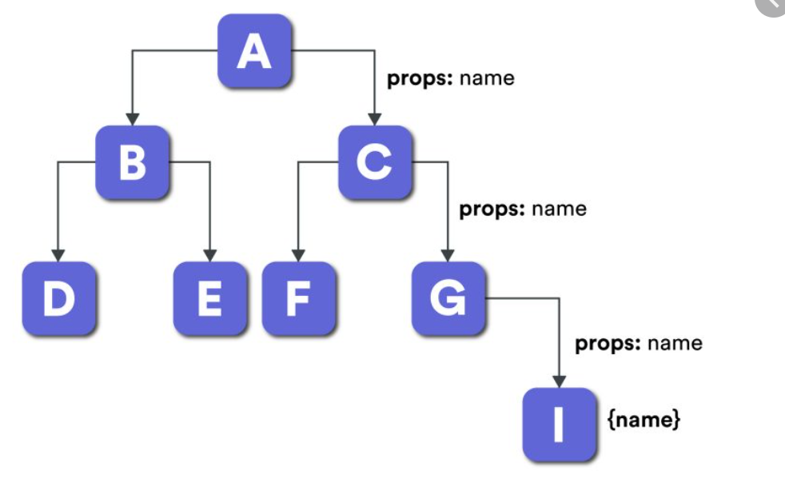

# 3. 상태 관리 라이브러리 비교 (Context vs Zustand vs Redux)

웹 애플리케이션을 만들다 보면 여러 컴포넌트가 동일한 데이터를 공유해야 하는 경우가 많습니다. 예를 들어, 로그인한 사용자의 정보를 헤더와 프로필 페이지 양쪽에서 보여줘야 할 수 있죠. 이렇게 여러 컴포넌트에 흩어져 있는 데이터, 즉 <strong>상태(State)</strong>를 어떻게 효과적으로 관리할 수 있을까요?

이번 시간에는 React의 상태 관리 방법들을 비교하며 각각의 장단점을 알아보겠습니다.

---

### 목차

1.  [상태 관리란?](#1-상태-관리란)
2.  [React Context API](#2-react-context-api)
3.  [Zustand](#3-zustand)
4.  [Redux](#4-redux)
5.  [비교 요약](#5-비교-요약)
6.  [결론: 어떤 것을 선택해야 할까요?](#6-결론-어떤-것을-선택해야-할까요)

---

## 1) 상태 관리란?

### 1-1) 상태(State)와 상태 관리

`useState`를 통해 우리는 컴포넌트 내부에서 데이터를 관리하는 방법을 배웠습니다. 여기서 '상태'란, 애플리케이션의 현재 상황을 나타내는 데이터이며, 이 데이터가 변경되면 화면도 그에 맞춰 다시 렌더링됩니다.

<strong>상태 관리(State Management)</strong>란, 이러한 애플리케이션의 상태를 체계적으로 관리하는 모든 활동을 의미합니다. 특히 애플리케이션의 규모가 커지고 복잡해질수록, 여러 컴포넌트가 함께 사용하는 상태(전역 상태)를 효율적으로 다루는 것이 매우 중요해집니다.

### 1-2) Props Drilling의 문제

만약 최상위 컴포넌트의 상태를 아주 깊숙한 곳에 있는 하위 컴포넌트에게 전달해야 한다면 어떻게 해야 할까요? 가장 간단한 방법은 중간에 있는 모든 컴포넌트를 거쳐 props로 전달하는 것입니다. 이를 **Props Drilling(프로퍼티 파고들기)** 이라고 합니다.



> 위 그림에서 `A` 컴포넌트의 데이터를 `I` 컴포넌트에서 사용하기 위해, 실제 데이터가 필요 없는 `C`와 `G` 컴포넌트를 거쳐 전달하고 있습니다.

이 방식은 몇 가지 문제를 야기합니다.

-   **불필요한 코드 증가**: 중간 컴포넌트들은 단지 데이터를 전달하기 위한 코드를 추가로 작성해야 합니다.
-   **유지보수의 어려움**: 데이터 구조가 변경되면, 데이터를 전달하는 모든 컴포넌트의 코드를 수정해야 합니다.
-   **가독성 저하**: 컴포넌트의 역할을 파악하기 어려워집니다.

이러한 Props Drilling 문제를 해결하기 위해 다양한 상태 관리 솔루션이 등장했습니다.

## 2) React Context API

**Context API**는 React에 내장된 기능으로, Props Drilling 없이 컴포넌트 트리 전체에 데이터를 제공할 수 있게 해줍니다. Context를 사용하면, 데이터를 필요로 하는 컴포넌트가 중앙 저장소(Store)에서 직접 데이터를 가져올 수 있습니다.

### 2-1) Context API 사용법

Context는 `createContext`, `Provider`, `useContext` 세 가지 주요 요소로 구성됩니다.

-   `createContext`: 데이터를 담을 Context 객체를 생성합니다.
-   `Provider`: 생성된 Context를 통해 하위 컴포넌트들에게 값을 전달하는 역할을 합니다.
-   `useContext`: Provider가 전달한 값을 사용하려는 컴포넌트에서 값을 받아오는 Hook입니다.

```jsx
// 1. Context 생성
const UserContext = React.createContext();

// 2. Provider로 값 전달
function App() {
  const user = { name: '홍길동', role: 'admin' };
  return (
    <UserContext.Provider value={user}>
      <Layout />
    </UserContext.Provider>
  );
}

// 3. useContext로 값 사용
function UserInfo() {
  const user = useContext(UserContext);
  return <div>안녕하세요, {user.name}님!</div>;
}
```

### 2-2) 장점과 단점

> [!NOTE]
> **장점**: React에 내장되어 있어 별도의 라이브러리 설치가 필요 없으며, 간단한 전역 상태 관리에 편리합니다.
> 
> **단점**: Context의 값이 변경되면, 해당 Context를 사용하는 모든 하위 컴포넌트들이 불필요하게 리렌더링 될 수 있어 성능 저하의 원인이 될 수 있습니다. 복잡한 상태 로직을 관리하기에는 부족함이 있습니다.

## 3) Zustand

**Zustand**는 '상태'를 의미하는 독일어로, 작고 빠르며 간결한 구문을 지향하는 상태 관리 라이브러리입니다. Context API의 단점을 보완하고, Redux의 복잡함을 덜어낸 대안으로 인기를 얻고 있습니다.

### 3-1) Zustand 사용법

Zustand는 `create` 함수로 스토어(store)를 만들고, 이 스토어를 커스텀 Hook처럼 사용하여 상태를 관리합니다.

```jsx
import { create } from 'zustand';

// 1. 스토어 생성
const useUserStore = create((set) => ({
  user: null,
  setUser: (newUser) => set({ user: newUser }),
  logout: () => set({ user: null }),
}));

// 2. 컴포넌트에서 스토어 사용
function UserInfo() {
  const user = useUserStore((state) => state.user);
  if (!user) return <div>로그인해주세요.</div>;
  return <div>안녕하세요, {user.name}님!</div>;
}

function LoginButton() {
    const setUser = useUserStore((state) => state.setUser);
    return <button onClick={() => setUser({ name: '홍길동' })}>로그인</button>
}
```

> [!IMPORTANT]
> `useUserStore((state) => state.user)` 와 같이 스토어의 특정 상태만 선택하여 구독할 수 있습니다. 이렇게 하면 해당 상태가 변경될 때만 컴포넌트가 리렌더링되어, Context API의 성능 문제를 해결할 수 있습니다.

### 3-2) 장점과 단점

> [!NOTE]
> **장점**:
> - 매우 적은 양의 코드로 상태 관리가 가능합니다 (적은 보일러플레이트).
> - 배우기 쉽고 사용법이 직관적입니다.
> - 상태의 특정 부분만 구독하여 불필요한 리렌더링을 방지하므로 성능에 유리합니다.
>
> **단점**:
> - Redux에 비해 미들웨어(middleware)나 개발 도구 생태계가 상대적으로 작습니다.
> - 정해진 규칙이 적어 대규모 프로젝트에서는 코드의 일관성을 유지하기 위한 팀의 노력이 필요할 수 있습니다.

## 4) Redux

**Redux**는 가장 오래되고 널리 사용되는 JavaScript 상태 관리 라이브러리입니다. 예측 가능한 상태 관리를 목표로 하며, 특히 규모가 크고 복잡한 애플리케이션에서 일관된 데이터 흐름을 유지하는 데 강력한 도구입니다.

### 4-1) Redux의 핵심 개념

Redux는 **Action, Reducer, Store** 라는 세 가지 핵심 원칙을 기반으로 동작합니다.

-   **Store**: 애플리케이션의 모든 상태가 저장되는 단 하나의 공간입니다. (Single Source of Truth)
-   **Action**: 상태에 어떤 변화가 필요한지 설명하는 객체입니다. `type` 필드를 필수로 가집니다. (예: `{ type: 'user/login', payload: { name: '홍길동' } }`)
-   **Reducer**: 순수 함수로, 현재 상태와 Action 객체를 받아 새로운 상태를 반환합니다.

> [!TIP]
> **보일러플레이트(Boilerplate)란?**
> 최소한의 변경으로 여러 곳에서 재사용되는 반복적인 코드를 의미합니다. Redux는 초기에 설정과 사용을 위해 작성해야 하는 보일러플레이트 코드가 많다는 단점이 있었습니다. 하지만 최근에는 **Redux Toolkit**이라는 공식 라이브러리를 통해 이러한 단점을 크게 개선했습니다.

### 4-2) 장점과 단점

> [!NOTE]
> **장점**:
> - 상태 변경이 예측 가능하고 추적하기 쉬워 디버깅에 용이합니다.
> - Redux DevTools와 같은 강력한 개발 도구를 지원하여 상태 변경 내역을 시간 순으로 확인하는 '시간 여행 디버깅'이 가능합니다.
> - 거대한 생태계와 커뮤니티를 가지고 있어 자료를 찾기 쉽습니다.
>
> **단점**:
> - 다른 라이브러리에 비해 학습 곡선이 가파르고 코드 작성이 복잡합니다.
> - 간단한 기능을 구현할 때도 많은 양의 코드를 작성해야 할 수 있습니다.

## 5) 비교 요약

| 구분 | Context API | Zustand | Redux (Redux Toolkit) |
| :--- | :--- | :--- | :--- |
| **학습 용이성** | 쉬움 | 매우 쉬움 | 어려움 |
| **코드량(보일러플레이트)** | 적음 | 매우 적음 | 많음 |
| **성능 최적화** | 기본 기능 없음 | 쉬움 (자동) | 상대적으로 복잡 |
| **개발 도구** | React DevTools | 제한적 | 강력함 (Redux DevTools) |
| **주요 사용처** | 간단한 테마, 언어 설정 등 | 중소규모 프로젝트, 빠른 개발 | 대규모, 복잡한 프로젝트 |

## 6) 결론: 어떤 것을 선택해야 할까요?

세 가지 도구 모두 훌륭하며, 상황에 따라 최적의 선택이 달라집니다.

-   **Context API**: 애플리케이션의 테마(다크/라이트 모드)나 언어 설정과 같이 자주 변경되지 않는 간단한 전역 상태를 관리할 때 적합합니다.
-   **Zustand**: `useState`에서 한 단계 나아가 중앙 상태 관리가 필요할 때, 복잡한 설정 없이 쉽고 빠르게 시작하고 싶을 때 최고의 선택이 될 수 있습니다. 중소규모 프로젝트에 매우 효과적입니다.
-   **Redux**: 여러 개발자가 참여하는 대규모 프로젝트에서 일관된 규칙을 바탕으로 안정적으로 상태를 관리해야 할 때 강력한 힘을 발휘합니다.

> [!IMPORTANT]
> 우리 커리큘럼에서는 **Zustand**를 사용하여 상태 관리를 학습할 것입니다. 배우기 쉬우면서도 강력한 기능을 제공하여, 여러분이 상태 관리의 핵심 개념을 즐겁게 익히고 실제 프로젝트에 자신감 있게 적용할 수 있도록 도와줄 것입니다.

---

- [목차로 돌아가기](./README.md)
- [이전 강의로 이동](./02-TanStack-Query-Features.md)
- [다음 강의로 이동](./04-Getting-Started-Zustand.md)
