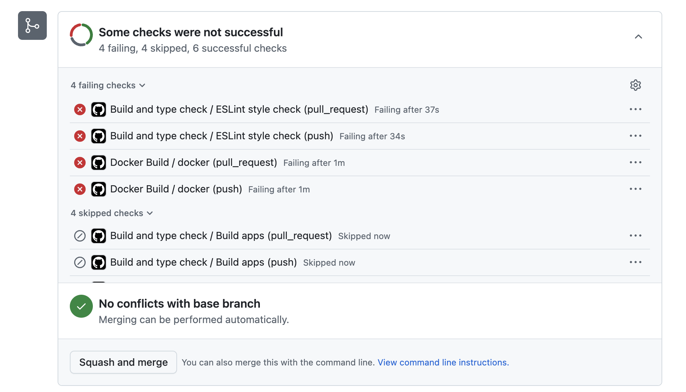

# 04. GitHub Actions로 CI/CD 파이프라인 구축하기

지금까지 우리는 코드를 작성하고, 변경 사항이 생기면 `git push` 명령어를 통해 GitHub 리포지토리에 저장했습니다. 만약 우리가 만든 웹 애플리케이션을 Vercel과 같은 서비스에 배포하려면 어떻게 해야 할까요? 아마도 매번 수동으로 빌드하고, 파일을 업로드하는 과정을 거쳐야 할 것입니다. 이러한 반복적인 수작업은 번거로울 뿐만 아니라, 사람이 직접 하기 때문에 실수가 발생할 가능성도 높습니다.

이러한 문제를 해결하기 위해 **CI/CD**라는 개념이 등장했습니다.

## 1-1) CI/CD란 무엇일까요?

CI/CD는 <strong>지속적 통합(Continuous Integration)</strong>과 <strong>지속적 배포(Continuous Deployment/Delivery)</strong>를 합쳐서 부르는 말입니다. 소프트웨어 개발 과정을 자동화하여 더 빠르고 안정적으로 사용자에게 제품을 전달하는 방법론을 의미합니다.

### 지속적 통합 (Continuous Integration, CI)

CI는 여러 개발자가 작성한 코드를 정기적으로 중앙 리포지토리(예: GitHub)에 통합하고, 통합될 때마다 **빌드**와 **테스트**를 자동으로 실행하는 과정을 말합니다.

> [!IMPORTANT]
> <strong>빌드(Build)</strong>란 우리가 작성한 React 코드(`jsx`, `js` 파일 등)를 브라우저가 이해할 수 있는 정적인 파일들(`html`, `css`, `js`)로 변환하는 과정을 의미합니다. `npm run build` 명령어가 바로 이 역할을 합니다.

CI를 통해 코드에 문제가 없는지(테스트 통과, 빌드 성공 등)를 수시로 검증함으로써, 여러 개발자의 코드가 합쳐질 때 발생할 수 있는 충돌이나 버그를 조기에 발견하고 해결할 수 있습니다.

### 지속적 배포 (Continuous Deployment, CD)

CD는 CI 과정을 통과한 코드를 자동으로 실제 운영 환경(사용자들이 접속하는 서버)까지 배포하는 것을 의미합니다. `main` 브랜치에 코드를 `push`하는 것만으로 테스트, 빌드, 배포까지의 모든 과정이 사람의 개입 없이 자동으로 진행됩니다.

> [!NOTE]
> <strong>지속적 전달(Continuous Delivery)</strong>이라는 용어도 있습니다. 이는 배포 직전 단계까지 자동화하고, 실제 배포는 사람이 수동으로 버튼을 눌러 진행하는 방식을 의미합니다. <strong>지속적 배포</strong>가 완전 자동화라면, <strong>지속적 전달</strong>은 반자동 배포라고 할 수 있습니다.

## 1-2) GitHub Actions 소개

**GitHub Actions**는 GitHub이 공식적으로 제공하는 CI/CD 도구입니다. GitHub 리포지토리 내에서 발생하는 특정 이벤트(예: `push`, `pull_request` 등)를 감지하여 우리가 미리 설정해둔 작업들을 자동으로 실행시켜 줍니다.

GitHub Actions를 사용하면 복잡한 CI/CD 파이프라인을 리포지토리 내에서 쉽게 구축하고 관리할 수 있습니다.

### GitHub Actions의 주요 구성 요소

GitHub Actions 워크플로우는 몇 가지 핵심 요소로 구성됩니다.

-   **Workflow (워크플로우):** 하나 이상의 `Job`으로 구성된 자동화된 프로세스 전체를 의미합니다. 워크플로우는 `.github/workflows` 디렉토리 안에 **YAML**이라는 형식의 파일로 정의합니다.
-   **Event (이벤트):** 워크플로우 실행을 유발하는 특정 활동을 의미합니다. 예를 들어 `git push`, `pull_request` 생성, 정해진 시간 등이 이벤트가 될 수 있습니다.
-   **Job (잡):** 하나의 가상 머신(Runner) 위에서 실행되는 단계(`Step`)들의 묶음입니다. 여러 `Job`을 동시에 실행하거나 순차적으로 실행할 수 있습니다.
-   **Step (스텝):** `Job` 안에서 실행되는 개별적인 작업 단위입니다. 간단한 셸 명령어를 실행하거나, 다른 사람이 만들어 둔 `Action`을 사용할 수 있습니다.
-   **Action (액션):** 워크플로우에서 반복적으로 사용할 수 있도록 미리 만들어진 코드 조각입니다. `actions/checkout` (코드 가져오기), `actions/setup-node` (Node.js 환경 설정) 등이 대표적인 예입니다.
-   **Runner (러너):** 워크플로우를 실행하는 가상 서버입니다. GitHub이 제공하는 가상 서버를 사용하거나(GitHub-hosted runner), 직접 서버를 설정하여 사용할 수도 있습니다(Self-hosted runner).

## 1-3) React 프로젝트를 위한 기본 워크플로우 작성하기

이제 GitHub Actions를 사용하여 React 프로젝트의 CI 파이프라인을 구축해 보겠습니다. 이 파이프라인은 `main` 브랜치에 코드가 `push`되거나 Pull Request가 생성될 때마다 자동으로 실행되며, 다음 작업을 수행합니다.

1.  Node.js 환경 설정
2.  프로젝트 의존성 패키지 설치 (`npm install`)
3.  테스트 실행 (`npm test`)
4.  프로젝트 빌드 (`npm run build`)

먼저, 프로젝트의 루트 디렉토리에 `.github`라는 폴더를 만들고, 그 안에 `workflows`라는 폴더를 추가합니다. 그리고 `workflows` 폴더 안에 `ci.yml` (또는 `main.yml`)과 같은 이름으로 YAML 파일을 생성합니다.

**경로:** `.github/workflows/ci.yml`

```yaml
# 워크플로우의 이름을 지정합니다.
name: React CI

# 워크플로우가 언제 실행될지를 정의합니다.
on:
  push:
    branches: [ "main" ] # main 브랜치에 push 이벤트가 발생했을 때 실행
  pull_request:
    branches: [ "main" ] # main 브랜치로 향하는 pull_request 이벤트가 발생했을 때 실행

# 워크플로우가 수행할 작업(Job)들을 정의합니다.
jobs:
  # 'build'라는 이름의 Job을 정의합니다.
  build:
    # 이 Job을 실행할 가상 머신의 종류를 지정합니다. (Ubuntu 최신 버전)
    runs-on: ubuntu-latest

    # Job이 수행할 단계(Step)들을 순서대로 정의합니다.
    steps:
      # 1. 리포지토리의 코드를 가상 머신으로 가져옵니다. (필수)
      # uses 키워드는 다른 사람이 만든 Action을 사용하겠다는 의미입니다.
      - name: Checkout repository
        uses: actions/checkout@v4

      # 2. Node.js 환경을 설정합니다.
      - name: Set up Node.js
        uses: actions/setup-node@v4
        with:
          node-version: '20' # 사용할 Node.js 버전을 지정합니다.

      # 3. npm을 사용하여 의존성 패키지를 설치합니다.
      # run 키워드는 셸 명령어를 직접 실행하겠다는 의미입니다.
      - name: Install dependencies
        run: npm install

      # 4. 테스트를 실행합니다.
      # 만약 테스트가 실패하면 워크플로우는 여기서 중단됩니다.
      - name: Run tests
        run: npm test

      # 5. 프로덕션 빌드를 실행합니다.
      - name: Build project
        run: npm run build
```

> [!CAUTION]
> YAML 파일은 들여쓰기가 매우 중요합니다. 스페이스 2칸을 사용하여 계층 구조를 정확하게 표현해야 합니다. 탭(Tab) 대신 스페이스(Space)를 사용하세요.

이제 이 파일을 `main` 브랜치에 `push`하면, GitHub 리포지토리의 'Actions' 탭에서 워크플로우가 자동으로 실행되는 것을 확인할 수 있습니다. 아직 실행 중인 워크플로우는 노란색으로 표시되며, 성공적으로 완료되면 초록색 체크 표시가, 실패하면 빨간색 X 표시가 나타납니다.

아래는 GitHub에서 'Actions' 탭을 클릭했을 때의 화면 예시입니다.


### 워크플로우의 기대 효과

이렇게 간단한 CI 워크플로우를 설정하는 것만으로도 우리는 여러 가지 이점을 얻을 수 있습니다.

-   **코드 품질 유지:** `main` 브랜치에 코드를 통합하기 전에 항상 테스트와 빌드를 거치므로, 문제가 있는 코드가 합쳐지는 것을 사전에 방지할 수 있습니다.
-   **개발 효율성 증가:** 코드를 `push`하기만 하면 반복적인 테스트와 빌드 작업을 GitHub Actions가 대신 처리해주므로, 개발자는 코드 작성에만 집중할 수 있습니다.
-   **안정적인 협업:** 팀 프로젝트에서 다른 사람이 작성한 코드가 내 코드와 합쳐질 때 발생할 수 있는 잠재적인 문제를 시스템이 자동으로 검증해 주므로, 더 안심하고 협업할 수 있습니다. Pull Request를 생성했을 때 이 워크플로우가 실행되도록 설정하면, 코드 리뷰어는 리뷰에만 집중할 수 있습니다.

> [!TIP]
> Pull Request를 생성했을 때, 자동으로 CI 워크플로우를 실행하도록 설정하면 코드의 문제를 조기에 발견할 수 있어 매우 유용합니다. 아래는 Pull Request에서 자동으로 CI 워크플로우가 동작한 모습입니다.
>
> CI 워크플로우 과정이 성공하면 아래와 같이 초록색 체크 표시가 나타납니다.
> 
> 
>
> CI 워크플로우 과정이 실패하면 아래와 같이 빨간색 X 표시가 나타납니다.
>
> 

## 1-4) GitHub Actions의 다양한 활용 사례

GitHub Actions는 단순히 React 프로젝트를 테스트하고 빌드하는 것 외에도 무궁무진한 가능성을 가지고 있습니다. 몇 가지 흥미로운 활용 사례를 소개합니다.

-   **자동 문서 생성 및 배포:** 프로젝트의 소스코드 주석을 읽어 자동으로 API 문서를 생성하고, 이를 웹페이지로 만들어 배포(GitHub Pages)할 수 있습니다.
-   **정기적인 작업 스케줄링:** 매일 아침 특정 스크립트를 실행하여 어젯밤 사이에 새로 생긴 이슈들을 수집해 슬랙(Slack)으로 리포트를 보내도록 설정할 수 있습니다.
-   **새로운 이슈/PR에 대한 자동 응답:** 누군가 새로운 이슈를 등록하면, 미리 정해놓은 템플릿에 따라 환영 메시지나 작성 가이드 댓글을 자동으로 달아줄 수 있습니다.
-   **릴리즈 노트 자동화:** `v1.0.0`과 같은 태그(Tag)를 `push`하면, 이전 태그 이후에 변경된 모든 Pull Request 목록을 취합하여 자동으로 릴리즈 노트를 작성하고 GitHub Release에 등록할 수 있습니다.
-   **다양한 플랫폼용 앱 빌드:** 안드로이드, iOS, Windows, macOS 등 각기 다른 운영체제에 맞는 애플리케이션을 동시에 빌드하고 서명하여 각 앱스토어에 업로드하는 것도 가능합니다.

> [!TIP]
> **[GitHub Marketplace](https://github.com/marketplace?type=actions)** 에는 전 세계 개발자들이 만들어 공유한 수많은 Action들이 있습니다. 내가 필요한 기능이 있다면 직접 만들기 전에 마켓플레이스에서 먼저 검색해 보세요. AWS, Google Cloud, Docker 등 대부분의 유명 서비스와 연동되는 Action들을 찾을 수 있습니다.

---

- [목차로 돌아가기](../README.md)
- [이전 강의로 돌아가기](./03-AI-for-Review-and-Testing.md)
- [다음 강의로 이동](./05-GitHub-Pages-Deployment.md)